# StockSage — Low-Level Design (LLD) UML Diagram

> **Version:** v0.8 · **Architecture:** CLI Node.js + TypeScript · **AI:** DeepSeek LLM + Jev (TypeSafe AI)

---

## 1. System Overview

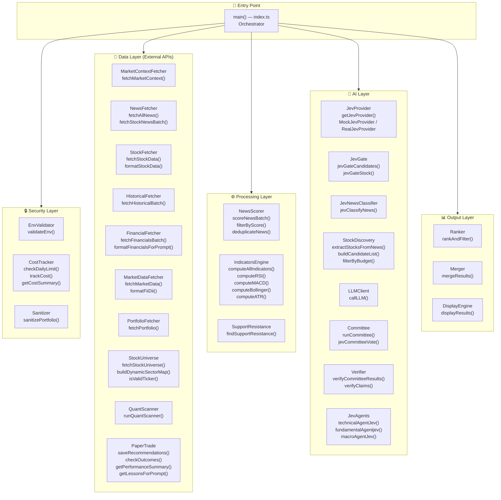

---

## 2. Complete Class & Interface Diagram

```mermaid
classDiagram

    %% ─────────── TYPES ───────────

    class StockSnapshot {
        +ticker: string
        +companyName: string
        +price: number
        +changePercent: number
        +pe: number | null
        +marketCap: number
        +volume: number
        +avgVolume: number
        +fiftyTwoWeekHigh: number
        +fiftyTwoWeekLow: number
        +fiftyDayAvg: number
        +twoHundredDayAvg: number
    }

    class CandidateStock {
        +ticker: string
        +source: news | top_mover | watchlist
        +reason: string
    }

    class MarketContext {
        +niftyPrice: number
        +niftyChangePercent: number
        +sensexChangePercent: number
        +regime: MarketRegime
        +upsideRange: RangeMinMax
        +downsideRange: RangeMinMax
        +jevGateThreshold: number
        +giftNiftyChange?: number
        +marketState?: string
    }

    class NewsItem {
        +title: string
        +description: string
        +source: string
        +publishedAt: string
    }

    class ScoredNewsItem {
        +sourceTierWeight: number
        +freshnessScore: number
        +crossSourceCount: number
        +crossSourceMultiplier: number
    }

    class TechnicalIndicators {
        +rsi: number
        +rsiSignal: OVERBOUGHT | OVERSOLD | NEUTRAL
        +macdLine: number
        +signalLine: number
        +histogram: number
        +macdSignal: BULLISH_CROSSOVER | BEARISH_CROSSOVER | NEUTRAL
        +bollingerUpper: number
        +bollingerMiddle: number
        +bollingerLower: number
        +bollingerPosition: UPPER | LOWER | MIDDLE
        +bollingerSqueeze: boolean
        +nearestSupport: number
        +nearestResistance: number
        +supportDistance: number
        +resistanceDistance: number
        +atr: number
        +atrPercent: number
    }

    class OHLCV {
        +date: Date
        +open: number
        +high: number
        +low: number
        +close: number
        +volume: number
    }

    class AgentVerdict {
        +ticker: string
        +sentiment: BULLISH | BEARISH | NEUTRAL | CAUTION
        +confidence: number
        +expectedMovePercent: number
        +reasoning: string
    }

    class JevDecision {
        +action: BUY | SELL | HOLD | AVOID
        +actionProbabilities: ActionProbs
        +holdingPeriod: INTRADAY | SWING | POSITIONAL
        +confidence: number
        +riskLevel: LOW | MEDIUM | HIGH
    }

    class Recommendation {
        +ticker: string
        +companyName: string
        +currentPrice: number
        +targetPrice: number
        +stopLoss: number
        +committeeVerdicts: AgentVerdict[]
        +action: string
        +confidence: number
        +holdingPeriod: string
        +riskLevel: string
        +jevProbabilities: Record
        +newsContext: string[]
    }

    class JevNewsClassification {
        +relevance: number
        +impactType: MACRO | SECTOR | COMPANY | NOISE
        +severity: HIGH | MEDIUM | LOW
        +actionable: number
    }

    class Holding {
        +ticker: string
        +companyName: string
        +quantity: number
        +avgPrice: number
        +currentPrice: number
        +pnlPercent: number
        +sector: string
    }

    class PortfolioSummary {
        +holdings: Holding[]
        +totalInvested: number
        +totalCurrent: number
        +overallPnlPercent: number
        +availableCash: number
    }

    class SanitizedPortfoilio {
        +holdingSummaries: HoldingSummary[]
        +overallStatus: string
        +existingTickers: string[]
        +existingSectors: string[]
    }

    class PaperTrade {
        +date: string
        +ticker: string
        +action: string
        +entryPrice: number
        +targetPrice: number
        +stopLoss: number
        +confidence: number
        +jevBuyProb: number
        +holdingPeriod: string
        +currentPrice?: number
        +pnlPercent?: number
        +outcome?: WIN | LOSS | OPEN | HIT_TARGET | HIT_STOPLOSS
        +failureReason?: string
        +lessonGenerated?: string
    }

    class VerfiedClaim {
        +claim: string
        +status: VERIFIED | DISPUTED | OPINION
        +confidence: number
    }

    class CostEntry {
        +date: string
        +provider: string
        +inputTokens: number
        +outputTokens: number
        +costUsd: number
    }

    class StockFinancials {
        +revenueGrowthYoy: number | null
        +profitMargin: number | null
        +debtToEquity: number | null
        +returnOnEquity: number | null
        +recommendationMean: number | null
        +numberOfAnalysts: number | null
    }

    %% ─────────── RELATIONSHIPS ───────────

    ScoredNewsItem --|> NewsItem : extends
    PortfolioSummary "1" *-- "many" Holding : contains
    SanitizedPortfoilio ..> PortfolioSummary : derived from
    Recommendation "1" *-- "many" AgentVerdict : committeeVerdicts
    PaperTrade ..> Recommendation : saved from
    OHLCV ..> TechnicalIndicators : used to compute
```

---

## 3. Detailed Execution Flow — Phase-by-Phase

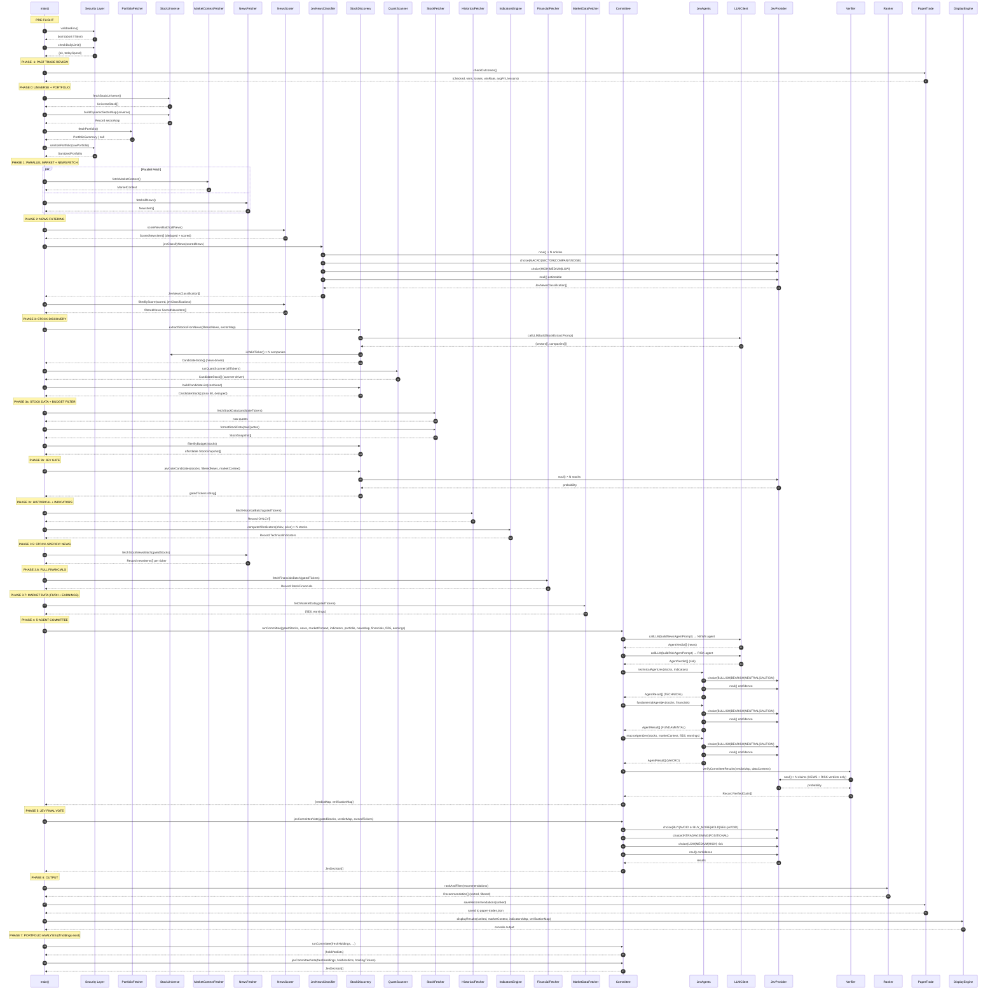

---

## 4. JevProvider Strategy Pattern

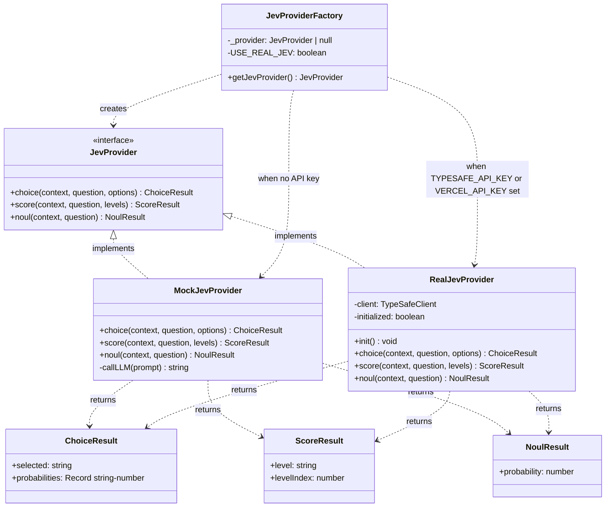

---

## 5. Committee Architecture — 5 Agents

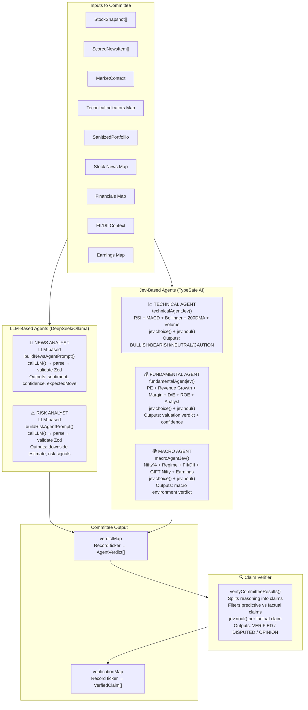

---

## 6. News Processing Pipeline

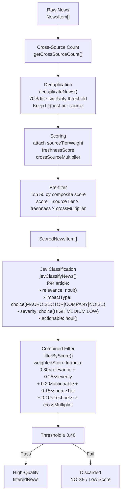

---

## 7. Stock Discovery Pipeline

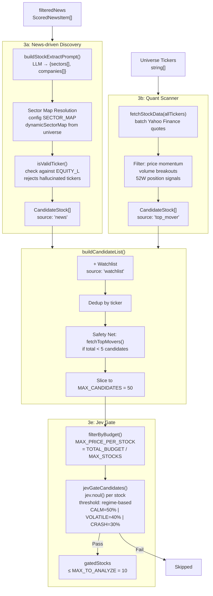

---

## 8. Technical Indicators Engine

```mermaid
classDiagram

    class IndicatorsEngine {
        +computeAllIndicators(ohlcv, price) TechnicalIndicators
    }

    class SMAComputer {
        +computeSMA(data, period) number
        «takes last N values»
        «returns average»
    }

    class EMAComputer {
        +computeEMA(data, period) number[]
        «multiplier = 2 / (period + 1)»
        «seed with first SMA»
    }

    class RSIComputer {
        +computeRSI(closes, period=14) number
        «calculates avg gain / avg loss»
        «RSI = 100 - (100 / (1 + RS))»
        «<30 = OVERSOLD, >70 = OVERBOUGHT»
    }

    class MACDComputer {
        +computeMACD(closes) MACDResult
        «EMA(12) - EMA(26) = MACD Line»
        «Signal = EMA(9) of MACD Line»
        «Histogram = MACD - Signal»
        «BULLISH_CROSSOVER / BEARISH_CROSSOVER»
    }

    class BollingerComputer {
        +computeBollinger(closes, period=20) BollingerResult
        «Middle = SMA(20)»
        «StdDev × 2»
        «Upper / Lower bands»
        «Squeeze = band width < 10% of middle»
    }

    class ATRComputer {
        +computeATR(ohlcv, period=14) ATRResult
        «True Range = max(H-L, |H-Cprev|, |L-Cprev|)»
        «ATR = EMA(TR, 14)»
        «atrPercent = atr / price * 100»
    }

    class SupportResistance {
        +findSupportResistance(ohlcv, price) SRResult
        «Pivot Points method»
        «Groups nearby levels ±1%»
        «nearestSupport / nearestResistance»
    }

    IndicatorsEngine --> SMAComputer
    IndicatorsEngine --> EMAComputer
    IndicatorsEngine --> RSIComputer
    IndicatorsEngine --> MACDComputer
    IndicatorsEngine --> BollingerComputer
    IndicatorsEngine --> ATRComputer
    IndicatorsEngine --> SupportResistance
```

---

## 9. Security & Cost Tracking

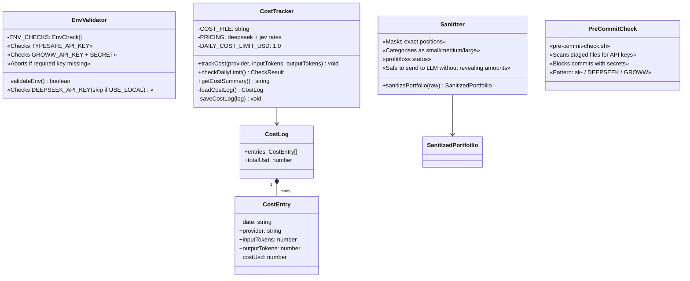

---

## 10. Paper Trade & Auto-Learning System

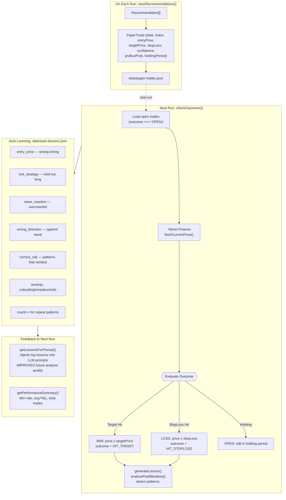

---

## 11. Data Flow — External APIs

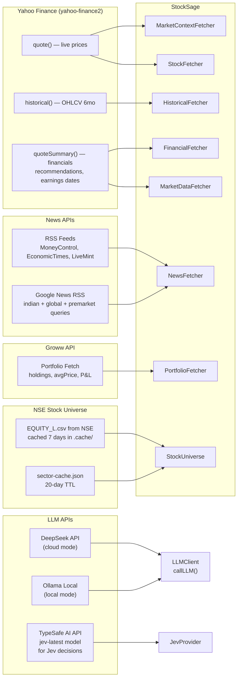

---

## 12. Configuration Constants — Key Design Parameters

| Constant | Value | Purpose |
|---|---|---|
| `MAX_CANDIDATES` | 50 | Max stocks entering discovery pool |
| `MAX_TO_ANALYZE` | 10 | Max stocks after Jev gate |
| `MAX_RECOMMENDATION` | 7 | Max final recommendations |
| `TOTAL_BUDGET` | ₹2000 | Trading capital |
| `MAX_STOCKS` | 2 | Stocks to invest in simultaneously |
| `PER_STOCK_BUDGET` | ₹1000 | = TOTAL_BUDGET / MAX_STOCKS |
| `MAX_PRICE_PER_STOCK` | ₹1000 | Budget filter threshold |
| `MIN_CONFIDENCE_THRESHOLD` | 30% | Minimum Jev confidence to include |
| `DAILY_COST_LIMIT_USD` | $1.00 | API cost guard |
| `NEWS_FILTER_THRESHOLD` | 0.40 | Combined news score cutoff |
| `CALM jevGate` | 50% | Probability needed in calm market |
| `VOLATILE jevGate` | 40% | Probability needed in volatile market |
| `CRASH_OR_RALLY jevGate` | 30% | Probability needed in extreme market |
| `SOURCE_TIERS Tier-1` | 1.0 | Reuters, Bloomberg, ET, MoneyControl |
| `SOURCE_TIERS Tier-2` | 0.8 | LiveMint, Business Standard, NDTV Profit |
| `SOURCE_TIERS Tier-3` | 0.5 | TOI, India Today, HT |

---

## 13. Module Dependency Graph

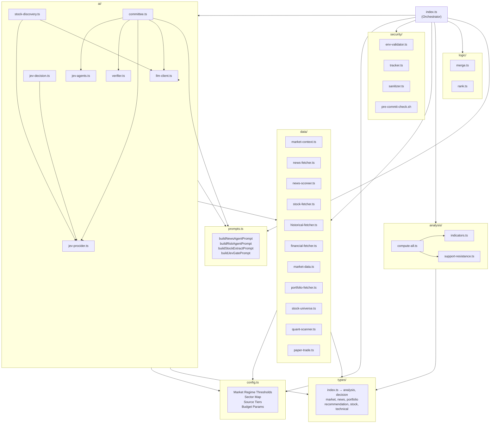

---

## 14. Market Regime State Machine

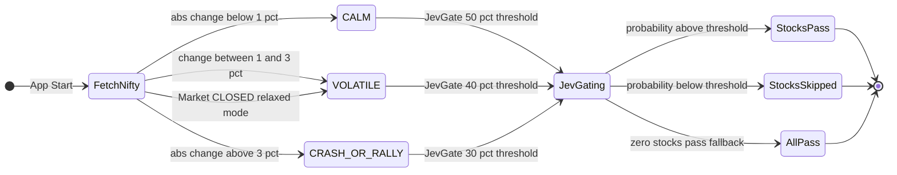

**Regime Thresholds Reference:**

| Regime | Nifty Change | JevGate | Upside Range | Downside Range |
|---|---|---|---|---|
| `CALM` | < 1.0% | 50% | 1–0% | 1–2% |
| `VOLATILE` | 1.0% – 3.0% | 40% | 2–5% | 1.5–3% |
| `CRASH_OR_RALLY` | ≥ 3.0% | 30% | 3–15% | 2–15% |
| *(Market Closed)* | any | 40% | VOLATILE defaults | VOLATILE defaults |

---

## 15. Docker / Deployment Architecture

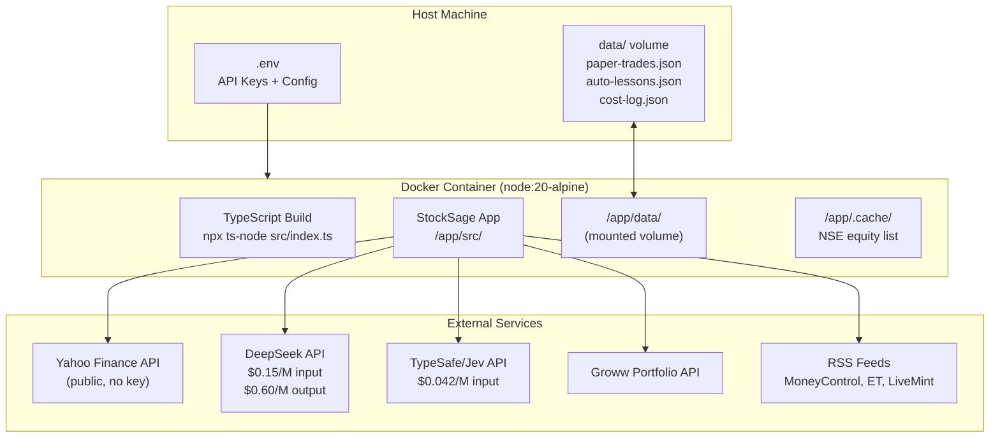

---

> **Generated by:** Antigravity AI | **Source:** `d:\Experiments\StockSage` | **Commit:** `1f8451d`
